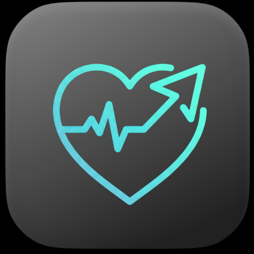

<div align="center">
  
  <h1 align="center">VytalCare</h1>
  <strong>The Agentic AI Health Companion</strong>
  <br />
  <br />
  <a href="https://react.dev/"></a>
  <a href="https://vitejs.dev/"></a>
  <a href="https://firebase.google.com/"></a>
  <a href="https://ai.google.dev/"></a>
  <a href="https://n8n.io/"></a>
  <a href="https://langgraph.dev/"></a>
  <a href="https://developers.google.com/fit">
  
</a>

<a href="https://qdrant.tech/">
  
</a>
  <br />
  <br />
  <p align="center">
    An intelligent preventive healthcare system that autonomously manages your wellness journey through AI-powered insights, automated workflows, and real-time health monitoring.
    <br />
    <a href="https://health-navigator-copy.vercel.app/"><strong>View Live Demo »</strong></a>
    <br />
    <br />
    <a href="#-key-features">Explore Features</a>
    ·
    <a href="#-getting-started">Get Started</a>
    ·
    <a href="https://github.com/AdityaPrakash781/VytalCare/issues">Report Bug</a>
  </p>
</div>

---

## 🚀 Key Features

### 🧠 Agentic AI Capabilities

VytalCare goes beyond passive tracking—it takes autonomous actions to keep you healthy:

- **Automated Calendar Integration**: Automatically syncs medication schedules to your Google Calendar, ensuring you never miss a dose
- **n8n Workflow Automation**: Triggers intelligent workflows when prescriptions are created, sending reminders to caregivers and healthcare providers via webhook
- **Gemini Vision Analysis**: AI-powered health metric analysis that generates structured wellness reports with actionable recommendations in tabular format
- **Predictive Health Scoring**: Weighted algorithmic engine calculates your daily Health Score (0-100) based on multiple biometric factors
- **Smart Notification System**: Real-time browser notifications for medication reminders with "Mark as Taken" functionality that auto-logs adherence

### 📊 Comprehensive Health Tracking

Monitor every aspect of your wellness in one unified dashboard:

- **Activity Metrics**: Steps (3-hour bucket visualization), calories burned, distance traveled with Google Fit REST API integration
- **Sleep Analytics**: Track sleep duration patterns with detailed session breakdowns and quality metrics
- **Heart Rate Monitoring**: Real-time cardiovascular data with trend analysis using Recharts visualizations
- **Hydration Tracker**: Daily water intake goals with automatic midnight resets and progress visualization
- **BMI Calculator**: Body Mass Index tracking with health range indicators
- **Weekly Trends**: Comprehensive charts showing 7-day activity patterns, distance covered, and sleep cycles

### 💬 Intelligent Chat & Voice

Conversational AI that understands your health context:

- **RAG-Powered Chatbot**: Gemini 2.5 Flash integration with Retrieval-Augmented Generation for personalized health guidance
- **Persistent Conversation History**: All chat messages stored in Firestore with timestamp and role tracking
- **Voice Input Support**: Natural language processing for hands-free health queries (implementation ready)
- **Multilingual Capability**: Support for health inquiries in multiple languages through Gemini's language model
- **Context-Aware Responses**: AI considers your current health metrics, medication schedule, and historical data when providing advice

### 🏥 Medication Management System

Full lifecycle prescription tracking with automated adherence monitoring:

- **CRUD Operations**: Create, read, update, and delete prescriptions with dosage and timing information
- **Multi-Time Scheduling**: Set multiple reminder times per medication with customizable frequency
- **Adherence Logging**: Automatic logging to `medication_logs` collection with `takenAt` timestamps and `dateKey` tracking
- **Caregiver Notifications**: n8n webhook triggers send prescription alerts to designated caregivers
- **Historical Tracking**: View medication history and compliance patterns over time

### 👤 User Profile & Persistence

Secure, cross-device synchronization of all health data:

- **Google OAuth 2.0**: Seamless sign-in with fitness scope permissions (activity, sleep, heart rate, location)
- **Firebase Authentication**: Support for anonymous sessions and persistent auth tokens
- **Real-Time Sync**: All profile data, medications, hydration logs, and chat history synced via Firestore
- **Multi-Device Access**: Access your complete health dashboard from any device with automatic data synchronization
- **Offline Support**: Local data caching with automatic sync when connection is restored

---

## 🛠️ Tech Stack

### Frontend Framework & Build Tools
- **React 18**: Modern component-based UI with hooks (useState, useEffect, useContext) for state management
- **Vite 6**: Lightning-fast development server with hot module replacement (HMR) and optimized production builds
- **Tailwind CSS**: Utility-first responsive styling with custom configurations for health-themed design system

### Data Visualization & UI Components
- **Recharts**: Declarative charts for activity metrics (LineChart, BarChart, AreaChart) with responsive design
- **Lucide React**: Beautiful, consistent icon library for health-related UI elements (Heart, Activity, Droplet, Calendar)
- **Custom Components**: Modular health tracking cards, metric displays, and interactive dashboard widgets

### Backend & Database
- **Firebase SDK v10**: 
  - **Firestore**: NoSQL database for user profiles, medications, hydration logs, chat history
  - **Firebase Auth**: Secure authentication with OAuth 2.0 and token management
  - **Firebase Storage**: Future support for health document uploads (lab results, prescriptions)

### AI & API Integrations
- **Google Gemini 2.5 Flash**: Generative AI for health insights, chat responses, and wellness analysis with structured output parsing
- **Google Fitness REST API**: Aggregated health data endpoints for steps, heart rate, sleep sessions, and activity metrics
- **n8n Webhook**: Workflow automation platform for medication reminders and caregiver notifications

### State Management & Utilities
- **React Context API**: Global state management for user authentication and health data
- **LocalStorage/SessionStorage**: Client-side caching for access tokens and temporary session data
- **Date-fns**: Date manipulation for medication scheduling and activity time bucketing

### Development Tools
- **ESLint**: Code quality and consistency enforcement with React-specific rules
- **PostCSS**: CSS processing with Tailwind CSS integration
- **npm**: Package management and dependency resolution

---

## ⚡ Getting Started

### Prerequisites

Before you begin, ensure you have the following installed and configured:

- **Node.js v16+** (v18+ recommended for optimal performance)
- **npm v8+** or **yarn v1.22+** package manager
- **Google Cloud Console Project** with the following APIs enabled:
  - Google Fitness API (for health data access)
  - Generative Language API (for Gemini AI)
- **Firebase Project** with Firestore and Authentication enabled
- **n8n Instance** (optional, for workflow automation)

### Installation Steps

1. **Clone the repository**
   ```bash
   git clone https://github.com/AdityaPrakash781/VytalCare.git
   cd VytalCare
   ```

2. **Install dependencies**
   ```bash
   npm install
   # or
   yarn install
   ```

3. **Configure environment variables**
   
   Create a `.env` file in the root directory with your API credentials:
   
   ```env
   # Firebase Configuration
   VITE_FIREBASE_API_KEY=your_firebase_api_key_here
   VITE_FIREBASE_AUTH_DOMAIN=your_project.firebaseapp.com
   VITE_FIREBASE_PROJECT_ID=your_project_id
   VITE_FIREBASE_STORAGE_BUCKET=your_project.appspot.com
   VITE_FIREBASE_MESSAGING_SENDER_ID=your_sender_id
   VITE_FIREBASE_APP_ID=your_app_id
   
   # Google Cloud Configuration
   VITE_GOOGLE_CLIENT_ID=your_google_oauth_client_id.apps.googleusercontent.com
   
   # Gemini AI Configuration
   VITE_GEMINI_API_KEY=your_gemini_api_key_here
   
   # n8n Webhook (Optional)
   VITE_N8N_WEBHOOK_URL=https://your-n8n-instance.hf.space/webhook/new-medication

   # Qdrant Vector Database (for RAG chatbot)
    QDRANT_URL=your_qdrant_cluster_url
    QDRANT_API_KEY=your_qdrant_api_key
    QDRANT_COLLECTION=medical_knowledge
   ```

4. **Start the development server**
   ```bash
   npm run dev
   # or
   yarn dev
   ```

5. **Access the application**
   
   Open your browser and navigate to `http://localhost:5173` (default Vite port)

### Google Cloud Console Setup

1. **Create a new project** or select an existing one
2. **Enable required APIs**:
   - Go to "APIs & Services" → "Enable APIs and Services"
   - Search for and enable "Fitness API"
   - Search for and enable "Generative Language API" (for Gemini)
3. **Configure OAuth 2.0**:
   - Go to "APIs & Services" → "Credentials"
   - Create OAuth 2.0 Client ID (Web application)
   - Add authorized JavaScript origins: `http://localhost:5173`, `https://your-production-domain.com`
   - Add authorized redirect URIs: `http://localhost:5173/callback`, `https://your-production-domain.com/callback`
   - Copy the Client ID to your `.env` file

### Firebase Project Setup

1. **Create a new Firebase project** at [console.firebase.google.com](https://console.firebase.google.com)
2. **Add a web app** to your Firebase project
3. **Enable Authentication**:
   - Go to "Authentication" → "Sign-in method"
   - Enable "Google" provider
   - Add your Google OAuth Client ID
4. **Create Firestore Database**:
   - Go to "Firestore Database" → "Create database"
   - Start in **production mode** (add security rules later)
   - Choose a Cloud Firestore location
5. **Copy configuration** values to your `.env` file

### Building for Production

```bash
npm run build
# or
yarn build
```

The optimized production build will be created in the `dist/` directory.

---

## 📁 Project Structure

```
VytalCare/
├── api/                          # Serverless API endpoints (Vercel functions)
│   └── chat-rag.js               # RAG chatbot backend endpoint
│
├── ingest/                       # Data ingestion + preprocessing scripts
│   ├── chunk_text.js
│   ├── code_mappings.js
│   ├── create_collection.js
│   ├── embed_and_upload.js
│   ├── fetch_medlineplus_connect.js
│   ├── medical_lists.js
│   ├── retrieve_context.js
│   ├── run_ingestion.js
│   ├── scrape_articles.js
│   └── test_retrieval.js
│
├── public/                       # Static public files (served as-is)
│   └── vite.svg
│
├── src/                          # Application source code
│   ├── assets/                   # Images, icons, and static media
│   │   ├── iconn.png
│   │   ├── iconn.webp
│   │   ├── react.svg
│   │   └── ...other assets
│   │
│   ├── components/               # React UI components
│   │   ├── Dashboard.jsx
│   │   ├── MedicationCard.jsx
│   │   ├── ChatBot.jsx
│   │   ├── ActivityCharts.jsx
│   │   └── ProfileSetup.jsx
│   │
│   ├── services/                 # API interaction / backend wrappers
│   │   ├── firebaseService.js
│   │   ├── googleFitService.js
│   │   └── geminiService.js
│   │
│   ├── utils/                    # Utility/helper functions
│   │   ├── healthScore.js
│   │   └── dateUtils.js
│   │
│   ├── contexts/                 # Global React contexts
│   │   └── AuthContext.jsx
│   │
│   ├── App.css
│   ├── App.jsx                   # Root UI file
│   ├── app2.jsx                  # (extra file in your screenshot)
│   ├── index.css
│   └── main.jsx                  # React DOM entry point
│
├── workflow/                     # LangGraph / n8n workflow files
│   └── ...workflow JSON configs
│
├── index.html                    # HTML entry point for Vite
├── package.json                  # Dependencies + scripts
├── package-lock.json
├── postcss.config.js
├── tailwind.config.js
├── tree.txt
├── vercel.json                   # Vercel deployment config
├── vite.config.js                # Vite build configuration
├── .gitignore
└── README.md

```

---

## 🗄️ Database Schema

VytalCare uses Firestore with the following structure under `/artifacts/{appId}/users/{userId}/`:

### Collections & Documents

| Collection / Doc | Fields | Description | Example |
|-----------------|--------|-------------|---------|
| **profile** (Document) | `userName`, `userAge`, `userGender`, `caregiverName`, `caregiverEmail`, `caregiverPhone`, `emergencyContact` | User demographic and caregiver information | `{ userName: "John Doe", userAge: 45, caregiverEmail: "jane@example.com" }` |
| **medications** (Collection) | `name`, `dose`, `frequency`, `times[]`, `notes`, `createdAt`, `updatedAt` | Active prescription tracking | `{ name: "Aspirin", dose: "100mg", times: ["08:00", "20:00"] }` |
| **medication_logs** (Collection) | `medicationId`, `medicationName`, `status`, `takenAt`, `scheduledTime`, `dateKey` | Medication adherence logs | `{ status: "taken", takenAt: 1702385400000, dateKey: "2024-12-12" }` |
| **hydration** (Collection) | `amount`, `goal`, `date`, `updatedAt` | Daily water intake tracking (auto-resets at midnight) | `{ amount: 1500, goal: 2000, date: "2024-12-12" }` |
| **chats** (Collection) | `role`, `text`, `sources[]`, `createdAt` | AI chatbot conversation history | `{ role: "assistant", text: "Your health score...", createdAt: 1702385400000 }` |
| **health_scores** (Collection) | `score`, `components`, `date`, `calculatedAt` | Daily health score calculations | `{ score: 85, components: { steps: 20, sleep: 18 }, date: "2024-12-12" }` |

### Data Access Patterns

- **Real-time Listeners**: Dashboard subscribes to `profile`, `medications`, and `hydration` for live updates
- **Batch Reads**: Chat history loaded in pages of 50 messages
- **Optimistic Updates**: UI updates immediately before Firestore confirmation for better UX
- **Compound Indexes**: Required for queries like "get all medication logs for today sorted by scheduledTime"

---

## 🔌 External Services & APIs

### Google Fitness API

**Base URL**: `https://www.googleapis.com/fitness/v1/users/me`

**Key Endpoints**:
- `/dataset:aggregate` - Aggregate health metrics over time periods
  - Steps: `com.google.step_count.delta`
  - Calories: `com.google.calories.expended`
  - Distance: `com.google.distance.delta`
  - Heart Rate: `com.google.heart_rate.bpm`
  - Weight: `com.google.weight`
- `/sessions` - Sleep and activity sessions with start/end times

**Authentication**: OAuth 2.0 with scopes:
- `https://www.googleapis.com/auth/fitness.activity.read`
- `https://www.googleapis.com/auth/fitness.heart_rate.read`
- `https://www.googleapis.com/auth/fitness.sleep.read`
- `https://www.googleapis.com/auth/fitness.location.read`

### Gemini AI API

**Endpoint**: `https://generativelanguage.googleapis.com/v1beta/models/gemini-2.5-flash:generateContent`

**Request Format**:
```json
{
  "contents": [{
    "parts": [{ "text": "Generate health insights based on: steps=8500, sleep=7.2hrs..." }]
  }],
  "generationConfig": {
    "temperature": 0.7,
    "maxOutputTokens": 2048
  }
}
```

**Response Parsing**: Extracts HTML table format for structured wellness reports

### n8n Webhook Automation

**Webhook URL**: `https://AdityaPrakash781-vytalcare-n8n.hf.space/webhook/new-medication`

**Payload**:
```json
{
  "userId": "user_123",
  "medicationName": "Aspirin",
  "dose": "100mg",
  "times": ["08:00", "20:00"],
  "caregiverEmail": "caregiver@example.com",
  "timestamp": 1702385400000
}
```

**Workflow Actions**: 
- Email notification to caregiver
- SMS reminder (optional)
- Calendar event creation
- Pharmacy refill alert

---

## 🎯 Health Score Calculation

VytalCare's proprietary health score algorithm weights multiple factors:

```javascript
// Weighted Health Score Engine
healthScore = (
  (steps / 10000) * 25 +           // 25% weight - Daily step goal
  (sleepHours / 8) * 20 +          // 20% weight - Sleep quality
  (heartRateVariability) * 15 +    // 15% weight - HRV score
  (hydration / dailyGoal) * 15 +   // 15% weight - Hydration
  (medicationAdherence) * 15 +     // 15% weight - Med compliance
  (activeMinutes / 30) * 10        // 10% weight - Active time
) * 100 / 100
```

**Score Ranges**:
- 🟢 85-100: Excellent health trajectory
- 🟡 70-84: Good, with room for improvement
- 🟠 50-69: Fair, requires attention
- 🔴 0-49: Poor, immediate action recommended

---

## 🔐 Security & Privacy

- **Data Encryption**: All Firestore data encrypted at rest and in transit (TLS 1.3)
- **OAuth 2.0**: Industry-standard authentication with minimal scope requests
- **HIPAA Considerations**: Architecture designed for future HIPAA compliance (requires BAA with Firebase)
- **Privacy First**: No third-party analytics or tracking; health data never shared without explicit consent
- **Local-First**: Sensitive calculations (health scores) performed client-side when possible
- **Secure Tokens**: Access tokens stored in memory, never in localStorage for production use

---

## 🚀 Deployment

### Vercel (Recommended)

1. **Connect GitHub repository** to Vercel
2. **Configure environment variables** in Vercel dashboard (Settings → Environment Variables)
3. **Deploy**: Automatic deployments on push to `main` branch
4. **Custom Domain**: Add your domain in Vercel project settings

### Manual Build & Deploy

```bash
# Build production bundle
npm run build

# Preview production build locally
npm run preview

# Deploy dist/ folder to your hosting provider
# (Netlify, Firebase Hosting, AWS S3, etc.)
```

---

## 📝 License

This project is licensed under the MIT License - see the LICENSE file for details.

---

## 🙏 Acknowledgments

- **Google Cloud Platform** for Fitness API and Gemini AI access
- **Firebase Team** for real-time database infrastructure
- **n8n Community** for workflow automation tools
- **Recharts** for beautiful, responsive health visualizations
- **Anthropic Claude** for README generation assistance

---

## 📧 Contact & Support

**Developers**: Aditya Prakash ( adiprakash35@gmail.com ) , Ananya Raghuveer , Shashank Ravindra , Swaraag Hebbar N.<br>
**Email**: [Create an issue](https://github.com/AdityaPrakash781/VytalCare/issues) for support  
**Live Demo:** [vytal-care.vercel.app](https://health-navigator-copy-hqt79ajqc.vercel.app/)

---

<div align="center">
  <p>Built with ❤️ for preventive healthcare</p>
  <p>
    <a href="#top">Back to Top ↑</a>
  </p>
</div>
